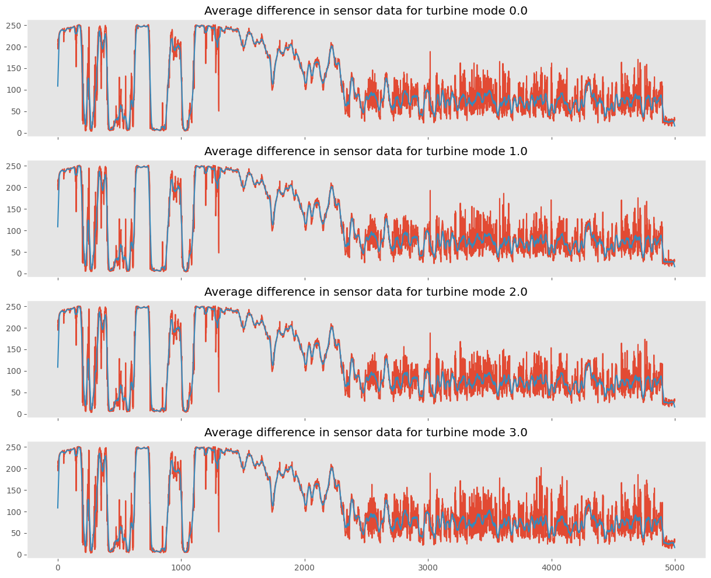

# 1. Setup

# 2. Exploratory data analysis

## 2.1. Label distribution

```python
np.unique(y, return_counts=True)
```

```text
(array([0., 1., 2., 3.]), array([1000, 1000, 1000, 1000], dtype=int64))
```

It appears we have an even distribution of the labels here. Therefore, assuming we care equally about all turbine operating modes, accuracy can be considered a sensible evaluation metric.

## 2.2. Visualising the sensor data for each state


I appears that there is no noticeable difference between the sampled sensor data of the 4 modes. We could try and plot the average sensor data of each mode.


However, when we look at the average of each mode, there's something quite noticeable: Around the 3,800th timesteps, the red line spikes up and reaches the blue line for turbine mode 3. This pattern does not appear in the remaining turbine modes. Therefore, the differences between the readings of the 2 sensors may be useful here.

## 2.3. Visualising scaled data

```text
DescribeResult(
    nobs=20000000,
    minmax=(
        array([0, 0], dtype=uint8),
        array([255, 255], dtype=uint8)
    ),
    mean=array(
        [ 34.72364305, 143.11656495]
    ),
    variance=array(
        [ 494.10723608, 7862.09026855]
    ),
    skewness=array(
        [ 2.99150686, -0.26584355]
    ),
    kurtosis=array(
        [11.89889674, -1.6850116 ]
    )
)
```

Overall, the reading of sensors appear to have the same lower and upper bounds, from 0 to 255. However, on average, the second sensor have much more variance and value than the first one. We can consider the second sensor to be on a different scale. Therefore, let's try to normalise them to 0 mean and unit variance for ease of analysis. However, when we get to the modelling stage, if we want to apply this technique, the scaling will only be fitted on the training set.


As discussed in the previous section, the difference between the readings from the two sensors may be indicative of the turbine mode (at least for the 4th mode). We will now analyse to see if there is any pattern in the difference.



In terms of the summary statistics for the scaled data:

    Summary statistic for turbine mode 0.0
    DescribeResult(nobs=5000000, minmax=(array([-1.56212106, -1.61406456, -2.82393927]), array([9.90962657, 1.26181821, 9.29065275])), mean=array([-1.36906311e-03, -3.12326507e-05, -1.33783045e-03]), variance=array([1.00356418, 0.99997435, 1.46111824]), skewness=array([ 3.02111839, -0.26575111,  0.34790822]), kurtosis=array([12.2643988 , -1.68523873,  1.39216469]))

    Summary statistic for turbine mode 1.0
    DescribeResult(nobs=5000000, minmax=(array([-1.56212106, -1.61406456, -2.82393927]), array([9.90962657, 1.26181821, 9.17787303])), mean=array([-0.00245772,  0.00163809, -0.00409581]), variance=array([1.00053517, 1.00297503, 1.4607519 ]), skewness=array([ 3.02892768, -0.26552219,  0.34254938]), kurtosis=array([12.21447021, -1.68566997,  1.28036494]))

    Summary statistic for turbine mode 2.0
    DescribeResult(nobs=5000000, minmax=(array([-1.56212106, -1.61406456, -2.82393927]), array([9.90962657, 1.26181821, 9.20042897])), mean=array([ 0.00044677, -0.0018547 ,  0.00230146]), variance=array([1.00702632, 0.99697754, 1.4591603 ]), skewness=array([ 2.9503019 , -0.26590539,  0.31158493]), kurtosis=array([11.26911071, -1.68410452,  1.042048  ]))

    Summary statistic for turbine mode 3.0
    DescribeResult(nobs=5000000, minmax=(array([-1.56212106, -1.61406456, -2.82393927]), array([9.90962657, 1.26181821, 9.2680968 ])), mean=array([0.00338002, 0.00024783, 0.00313218]), variance=array([0.98885558, 1.0000677 , 1.43564748]), skewness=array([ 2.9654927 , -0.26622933,  0.31215879]), kurtosis=array([11.8518648 , -1.68505372,  1.2874109 ]))

Analysing the scaled data does not provide better insights. In terms of the overall trend and summary statistics, there is no clear difference in sensor data across all 4 modes.

Another the aspect that these plots and statistics failed to capture is very subtle anomalies, as they will be averaged out, and they will not be visible when we look at the time series of 5,000 data points all at once. Therefore, we can propose the following hypotheses:

- Local patterns (e.g., the spikes) may be more important in classifying the turbine modes than global ones (e.g., overall trend, summary statistics).
- Anomalies that are very subtle and very hard to capture visually could be important in classifying the turbine modes.

Amongst the deep learning approaches, convolutional-based neural networks are very good for identifying these patterns and thus can be promising in this task.

# 3. Modelling

Let's discuss what type of sequence prediction approach is most sensible to predict the operating mode of a turbine based on the two sensor reading time series.

- **sequence-to-vector**: This is a natural choice - We are dealing with a time series classification problems. We have 4000 sequences that matches to 4000 operating modes.
- **sequence-to-sequence**: This is suitable when the output can be a sequence (e.g., time series), or when there is some dependency between the operating modes. However in our case, there is no time information so we won't be able to connect these 4000 operating modes. We can treat them as independent. Also, each sequence has a length of 5000, and we only have one label for the whole sequence, so won't be able to model this as a seq-to-seq problem. Finally, we do not know if the sequences are ordered and hence it would be risky to make such assumption.
- **encoder-decoder**: This works best for translation tasks, or when output is not a scalar, which makes this approach not suitable for our problem.

To follow the sequence-to-vector approach, the data needs to be reshaped as follows:

- input: `(n_batches, batch_size, n_timesteps, n_features)`.
- Output: `(n_batches, batch_size, )`.

In our case, if the batch size is 64 and the sequences are passed in without further processing, the input shape for each batch would be `(64, 5000, 2)` and the output shape would be `(64, )`

## 3.1. Baselines

Before investing time in developing a neural network, it is useful to establish some baselines:

- Random prediction: Since we have an even split between all turbines modes, predicting randomly (or predicting only one turbine mode) can gives us 25% accuracy.
- Build a multi-class logistic regression to predict the turbine mode based on the summary statistics: This approach may not be significantly better than random prediction because we have discovered that all 4 modes had similar summary statistics.

Therefore, we can determine our baseline accuracy to be 25%

## 3.2. Main approach

### 3.2.1. Reccurent networks

We can include this method in for the sake of completeness. This is because these networks takes longer to train, and as noted in section 2, local patterns instead of sequential patterns could be indicative of the turbine modes. In addition, since our sequence length is 5000, recurrent models will encounter difficulties learning such sequences. Here, a `GRU` layer was chosen as it is capable of memorising long-term patterns. This is useful comparing to using simple recurrent neural network, because if the point of interest is at the middle of the sequence, then by the time the recurrent network gets to the end, it would have already 'forgotten' the point of interest. Here, we rely on GRU's capability of memorising long-past information until the end of the sequence.

    Model: "recurrent_gru"
    _________________________________________________________________
    Layer (type)                Output Shape              Param #
    =================================================================
    gru_3 (GRU)                 (None, 128)               50688
    dense_6 (Dense)             (None, 64)                8256
    dense_7 (Dense)             (None, 4)                 260
    =================================================================
    Total params: 59,204
    Trainable params: 59,204
    Non-trainable params: 0
    _________________________________________________________________


    Train performance
    50/50 [==============================] - 6s 119ms/step - loss: 0.3196 - accuracy: 0.8697
    Val performance
    7/7 [==============================] - 1s 112ms/step - loss: 0.3194 - accuracy: 0.8775
    Test performance
    7/7 [==============================] - 1s 112ms/step - loss: 0.3424 - accuracy: 0.8500

The model takes a really long time to train, because the training cannot be parallelised and we are dealing with very long sequences. However, it still manages to achieve a very high test accuracy of 85%, which has well surpassed our baseline of 25%.

### 3.2.2. Conv1D-based network

As a starting point, we create a simple neural network with a Conv1D layer as hidden layer. We do have the option of using a `GlobalAveragePooling1D` layer after the convolutional layer instead of a `Flatten` layer, but since we only have 64 filters of Conv1D of size 6, the number of parameters is still quite small, so averaging may result in too much information loss and is not totally necessary.

    Model: "conv1d_base"
    _________________________________________________________________
     Layer (type)                Output Shape              Param #
    =================================================================
     conv1d (Conv1D)             (None, 4995, 64)          832
     flatten (Flatten)           (None, 319680)            0
     dense_8 (Dense)             (None, 4)                 1278724
    =================================================================
    Total params: 1,279,556
    Trainable params: 1,279,556
    Non-trainable params: 0
    _________________________________________________________________


    Train performance
    50/50 [==============================] - 1s 19ms/step - loss: 0.1973 - accuracy: 0.9022
    Val performance
    7/7 [==============================] - 0s 18ms/step - loss: 0.2311 - accuracy: 0.9050
    Test performance
    7/7 [==============================] - 0s 18ms/step - loss: 0.2567 - accuracy: 0.8900

The model started overfitting after the 10th epochs. Interestingly, after only 2 to 3 epochs, the training accuracy was still increasing but validation accuracy has stopped improving. This is understandable as this is a relatively simple model with no regularisation implemented. However, it has managed to achieved better loss and accuracy than the GRU-based model with significantly less time and compute resource.

Next, we can try adding more layers and introducing regularisation to the model.

    Model: "conv1d_regularised"
    _________________________________________________________________
     Layer (type)                Output Shape              Param #
    =================================================================
     conv1d_1 (Conv1D)           (None, 5000, 64)          832
     conv1d_2 (Conv1D)           (None, 5000, 64)          24640
     dropout (Dropout)           (None, 5000, 64)          0
     conv1d_3 (Conv1D)           (None, 5000, 32)          12320
     max_pooling1d (MaxPooling1D)  (None, 4998, 32)         0
     flatten_1 (Flatten)         (None, 159936)            0
     dense_9 (Dense)             (None, 4)                 639748
    =================================================================
    Total params: 677,540
    Trainable params: 677,540
    Non-trainable params: 0
    _________________________________________________________________


    Train performance
    50/50 [==============================] - 3s 50ms/step - loss: 0.2210 - accuracy: 0.9041
    Val performance
    7/7 [==============================] - 0s 44ms/step - loss: 0.2479 - accuracy: 0.9000
    Test performance
    7/7 [==============================] - 0s 45ms/step - loss: 0.3003 - accuracy: 0.8825

It appears that our 'base' model is a really hard baseline to beat! Adding more layers and regularisation did not improve the model.

Convolutional layers in general are useful for problems where a sub-section of the data can be informative, regardless of its position. Therefore, Conv1D layers are useful in applications such as anomaly detection for time series, or time series classification (like this task) where each class can be determined by a local pattern, for example, sudden spikes in sensor readings can be attributed to faulty equipments. In contrast, recurrent layers are more suited for applications where the long-term, sequential dependency in data is important, for example, time series prediction, speech recognition. In our case, this could be relevant if the task is to predict the next `n` sensor readings, because the next sensor readings can heavily depends on the recent readings.

In addition, since convolutional layers can be trained in parallel, they are more suitable for applications involving a large volume of data, or long sequences, or with limited computing power, than recurrent layers, which need to be trained sequentially. As a result, training convolutional models would take significantly less time.

Therefore, in this project, it would be extremely unlikely for reccurent models to outperform our models using convolutional layers.

### 3.2.3. Conv2D

Another, less frequently used tool for analyzing time-series data is convolutional neural networks with 2D convolutional layers. For this to work, time series need to be converted into “images” (matrices of numbers). The paper “Convolutional neural network fault classification based on time series analysis for benchmark wind turbine machine” by Rahimilarki, Gao, Jin, and Zhang (published 2022 in “Renewable Energy”) describes how two-dimensional CNNs can be applied to the problem at hand.

In the paper, the novelty is in the way the timeseries data are transformed into images - that is by dividing the time series (1 dimensional) into sequences of equal length and stack them vertically to construct a 2-dimensional array. This method may work really well for our problem, because there may be a cyclical pattern in the data. This is because the movement of the wind turbine blades are repetitive, which can produce cyclical data. Therefore, if the length of the sub-sequence are chosen carefully, the correlation between two adjacent elements in the 2D array could be very high for turbines operating in normal conditions.

For example, assuming we have a sensor that records the angle of a turbine blade in regular intervals, then the data it produces may be `120-240-360-120-240-360-120-240-360`. If the turbine functions normally, then we can expect the sub-sequence of `120-240-360` to repeat indefinitely. However, the angles of a mal-functioning turbine blade may be `120-242-360-120-241-360-120-239-360`. This difference is very subtle and would be impossible to notice visually. But if we follow the paper's approach by diving the data into sequences of length 3 and stacking them vertically, we will have the following:

- Healthy turbine:

```
| 120 | 240 | 360 |
| 120 | 240 | 360 |
| 120 | 240 | 360 |
```

- Mal-functioning turbine:

```
| 120 | 242 | 360 |
| 120 | 241 | 360 |
| 120 | 239 | 360 |
```

A 2D convolutional layer will be able to pick up the difference in the turbine blade's angles in the second column of the mal-functioning turbine's data.

For this to work, the sequence length will need to be tuned so that the correlation between two adjacent pixels are maximised. In cases where the length of the original time series is not divisble by the sequence length, it would be required to pad the last sequence to produce a rectangular image. However, in this paper, this was not performed - and the authors also clearly noted that
> In addition, it is worth to mention that in CNN approaches, the information is extracted from the image by analysing the relationship between the adjacent pixels. **However, in this paper, the adjacent pixels might not show any meaning.**.

Therefore, this technique may not yield a significant improvement over using 1D convolutions.

Nevertheless, we can try implementing the paper and see if there's any performance gain. After reshaping, a sequence of 2 timeseries would look like this:


We can now replicate the proposed network architecture implemented in the paper as follows:

    Model: "conv2d_base"
    _________________________________________________________________
     Layer (type)                Output Shape              Param #
    =================================================================
     conv2d (Conv2D)             (None, 100, 100, 32)      320
     conv2d_1 (Conv2D)           (None, 100, 100, 32)      9248
     dropout_1 (Dropout)         (None, 100, 100, 32)      0
     conv2d_2 (Conv2D)           (None, 100, 100, 16)      4624
     max_pooling2d (MaxPooling2D)  (None, 98, 98, 16)       0
     flatten_2 (Flatten)         (None, 153664)            0
     dense_10 (Dense)            (None, 4)                 614660

    =================================================================
    Total params: 628,852
    Trainable params: 628,852
    Non-trainable params: 0
    _________________________________________________________________


    Train performance
    50/50 [==============================] - 2s 32ms/step - loss: 0.2015 - accuracy: 0.9044
    Val performance
    7/7 [==============================] - 0s 30ms/step - loss: 0.2367 - accuracy: 0.9050
    Test performance
    7/7 [==============================] - 0s 28ms/step - loss: 0.2697 - accuracy: 0.8900

As expected, this did not yield better performance.

#### 3.2.2.2. Tuning the replicated CNN

In this section, we will consider the following approaches:

1. Using the most complex CNN architecture proposed in the paper
2. Adding more hidden layers to the fully-connected part
3. Tune the configuration of the existing layers of the current network
4. Using transfer learning

##### **Approach 1: Using the most complex CNN architecture proposed in the paper**

In section 5, the authors introduced a slightly more complex CNN architecture with more layers, which yielded the best performance when there are 4 sensors. We will see if the proposed architecture can yields a better accuracy for our task which only has 2 sensors.

    Model: "conv2d_complex"
    _________________________________________________________________
     Layer (type)                Output Shape              Param #
    =================================================================
     conv2d_3 (Conv2D)           (None, 100, 100, 128)     1280
     conv2d_4 (Conv2D)           (None, 100, 100, 64)      73792
     dropout_2 (Dropout)         (None, 100, 100, 64)      0
     conv2d_5 (Conv2D)           (None, 100, 100, 32)      18464
     conv2d_6 (Conv2D)           (None, 100, 100, 13)      3757
     max_pooling2d_1 (MaxPooling2D)  (None, 98, 98, 13)       0
     flatten_3 (Flatten)         (None, 124852)            0
     dense_11 (Dense)            (None, 4)                 499412
    =================================================================
    Total params: 596,705
    Trainable params: 596,705
    Non-trainable params: 0
    _________________________________________________________________


    Train performance
    50/50 [==============================] - 4s 79ms/step - loss: 0.2127 - accuracy: 0.9000
    Val performance
    7/7 [==============================] - 1s 81ms/step - loss: 0.2518 - accuracy: 0.9025
    Test performance
    7/7 [==============================] - 1s 75ms/step - loss: 0.3103 - accuracy: 0.8750

##### **Approach 2: Adding more hidden layers to the fully-connected part**

So far, we have focused on improving the convolutional layers which performed feature extraction, which did not yield better performance. Therefore, it would be reasonable to explore improving the classification layer.

    Model: "conv2d_FC"
    _________________________________________________________________
     Layer (type)                Output Shape              Param #
    =================================================================
     conv2d (Conv2D)             (None, 100, 100, 32)      320
     conv2d_1 (Conv2D)           (None, 100, 100, 32)      9248
     dropout (Dropout)           (None, 100, 100, 32)      0
     conv2d_2 (Conv2D)           (None, 100, 100, 16)      4624
     max_pooling2d (MaxPooling2D  (None, 98, 98, 16)       0
     )
     flatten (Flatten)           (None, 153664)            0
     dense (Dense)               (None, 512)               78676480
     dense_1 (Dense)             (None, 512)               262656
     dense_2 (Dense)             (None, 4)                 2052
    =================================================================
    Total params: 78,955,380
    Trainable params: 78,955,380
    Non-trainable params: 0
    _________________________________________________________________


    Train performance
    50/50 [==============================] - 4s 34ms/step - loss: 0.2139 - accuracy: 0.9019
    Val performance
    7/7 [==============================] - 0s 32ms/step - loss: 0.2335 - accuracy: 0.9050
    Test performance
    7/7 [==============================] - 0s 31ms/step - loss: 0.2660 - accuracy: 0.8900

This did not yield better performance.

##### **Approach 3. Tune the configuration of the existing layers of the current network**

We will now tune the configuration of the current network using the `keras-tuner` library.

```
    Trial 30 Complete [00h 03m 48s]
    val_loss: 1.3862947225570679

    Best val_loss So Far: 0.23773032426834106
    Total elapsed time: 00h 41m 26s
    INFO:tensorflow:Oracle triggered exit

    INFO:tensorflow:Oracle triggered exit
```

```
    -------- Best hyperparameters:
    n_filters_conv1: 36
    n_filters_conv2: 124
    n_filters_conv3: 44
    dropout_rate: 0.30791117675740814
    learning_rate: 0.0020674508263974637
    tuner/epochs: 15
    tuner/initial_epoch: 5
    tuner/bracket: 1
    tuner/round: 1
    tuner/trial_id: 0023
```


    Train performance
    50/50 [==============================] - 5s 94ms/step - loss: 0.2182 - accuracy: 0.9028
    Val performance
    7/7 [==============================] - 1s 83ms/step - loss: 0.2353 - accuracy: 0.9050
    Test performance
    7/7 [==============================] - 1s 85ms/step - loss: 0.2780 - accuracy: 0.8875

Same as before, spending additional time in tuning the model did not improve the performance.

##### **Approach 4: Using transfer learning**

We could consider the following options:

- Using pretrained model for the feature extraction layer: This is unlikely to yield better performance, because most image-based models are learned to extract feature from objects in images, which is completely different from the settings we have here (time series data reshaped into images). Therefore, the feature learned by these model are unlikely to be useful.
- Using the architecture of pretrained models: We have seen from the previous experiments that adding more complex structure did not meaningfully improved the model performance. In addition, these complex architecture were tuned for a very large dataset of images, which we do not have. Therefore, our dataset will not be able to fully utilise these architecture.

As a result, using transfer learning is not considered a suitable approach for our task.

# 4. Determining the best model

The following table summarises the model's performances:

<div>
<table border="1" class="dataframe">
  <thead>
    <tr style="text-align: right;">
      <th></th>
      <th>model_name</th>
      <th>train_loss</th>
      <th>train_accuracy</th>
      <th>val_loss</th>
      <th>val_accuracy</th>
      <th>test_loss</th>
      <th>test_accuracy</th>
    </tr>
  </thead>
  <tbody>
    <tr>
      <th>0</th>
      <td>recurrent_gru</td>
      <td>0.319579</td>
      <td>0.869687</td>
      <td>0.319394</td>
      <td>0.8775</td>
      <td>0.342429</td>
      <td>0.8500</td>
    </tr>
    <tr>
      <th>1</th>
      <td>conv1d_base</td>
      <td>0.197288</td>
      <td>0.902188</td>
      <td>0.231081</td>
      <td>0.9050</td>
      <td>0.256667</td>
      <td>0.8900</td>
    </tr>
    <tr>
      <th>2</th>
      <td>conv1d_regularised</td>
      <td>0.220988</td>
      <td>0.904063</td>
      <td>0.247878</td>
      <td>0.9000</td>
      <td>0.300314</td>
      <td>0.8825</td>
    </tr>
    <tr>
      <th>3</th>
      <td>conv2d_base</td>
      <td>0.201450</td>
      <td>0.904375</td>
      <td>0.236744</td>
      <td>0.9050</td>
      <td>0.269749</td>
      <td>0.8900</td>
    </tr>
    <tr>
      <th>4</th>
      <td>conv2d_complex</td>
      <td>0.212722</td>
      <td>0.900000</td>
      <td>0.251839</td>
      <td>0.9025</td>
      <td>0.310265</td>
      <td>0.8750</td>
    </tr>
    <tr>
      <th>5</th>
      <td>conv2d_FC</td>
      <td>0.213935</td>
      <td>0.901875</td>
      <td>0.233481</td>
      <td>0.9050</td>
      <td>0.265963</td>
      <td>0.8900</td>
    </tr>
    <tr>
      <th>6</th>
      <td>conv2d_tuned</td>
      <td>0.218203</td>
      <td>0.902812</td>
      <td>0.235303</td>
      <td>0.9050</td>
      <td>0.278023</td>
      <td>0.8875</td>
    </tr>
  </tbody>
</table>
</div>

Unsurprisingly, recurrent models had the lowest performance, and Conv2D-based approach did not offer meaningful improvement over Conv1D-based models. Interestingly, all convolutional-based models achieved a similar level of performance, and adding more layers to the models did not significantly change their performance. In the paper, the authors achieved a 98% accuracy using the Conv2D approach, where we have only achieved 89%, even though the data was processed the same way and the same model architectures were used. This could be because the dataset used in this project is not the same as that used in the paper. Further investigation into data quality may shed light on this.

Nevertheless, we can choose the `conv1d_base` model as our best model for the following reasons:

- It yields the best accuracy and losses, both on the validation and test sets.
- It is the most simple and fastest to train.
- It requires little data preprocessing.
- In terms of model transparency, we can visualise the feature each convolutional filter captures to better understand the data. While this is also possible for the Conv2D-based approach, the vertical dimension does not carry any information (because the adjacent pixels are not correlated).

We can now train the model on the training and validation set, and evaluate on the test set.

    Model: "conv1d_base_train_val"
    _________________________________________________________________
     Layer (type)                Output Shape              Param #
    =================================================================
     conv1d (Conv1D)             (None, 4995, 64)          832
     flatten_2 (Flatten)         (None, 319680)            0
     dense_2 (Dense)             (None, 4)                 1278724

    =================================================================
    Total params: 1,279,556
    Trainable params: 1,279,556
    Non-trainable params: 0
    _________________________________________________________________


    Train performance
    57/57 [==============================] - 1s 19ms/step - loss: 0.1794 - accuracy: 0.9133
    Val performance
    7/7 [==============================] - 0s 17ms/step - loss: 0.2445 - accuracy: 0.8900
    Test performance
    7/7 [==============================] - 0s 17ms/step - loss: 0.2445 - accuracy: 0.8900

<div>
<table border="1" class="dataframe">
  <thead>
    <tr style="text-align: right;">
      <th></th>
      <th>model_name</th>
      <th>train_loss</th>
      <th>train_accuracy</th>
      <th>val_loss</th>
      <th>val_accuracy</th>
      <th>test_loss</th>
      <th>test_accuracy</th>
    </tr>
  </thead>
  <tbody>
    <tr>
      <th>0</th>
      <td>conv1d_base_train_val</td>
      <td>0.179389</td>
      <td>0.913333</td>
      <td>0.244501</td>
      <td>0.89</td>
      <td>0.244501</td>
      <td>0.89</td>
    </tr>
  </tbody>
</table>
</div>
